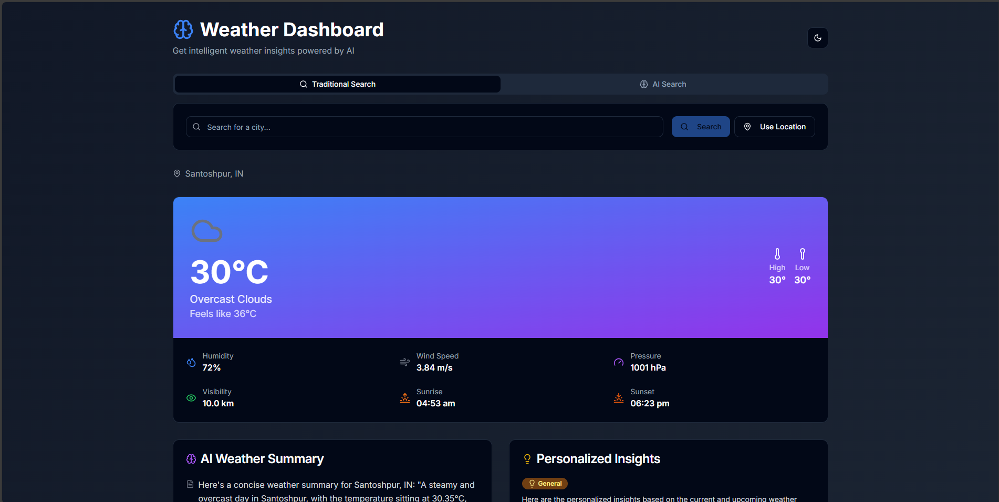

# Weather Dashboard


Welcome to **Weather Dashboard** – a modern, AI-powered weather app built with Next.js, TypeScript, and Tailwind CSS. Get real-time weather updates, forecasts, and smart insights, all in a beautiful and responsive interface.

## 🌟 Why Weather Dashboard?

- **AI-Powered:** Get smart, natural language weather insights and recommendations.
- **Beautiful UI:** Clean, modern, and responsive design for all devices.
- **Instant Alerts:** Stay ahead with real-time severe weather notifications.
- **Open Source:** Free to use, modify, and contribute!

## 📸 Preview



*Above: Example of the Weather Dashboard interface. Replace with your own screenshot!*

## 🚀 Features

- **Current Weather:** Instantly view the latest weather conditions for any location.
- **Forecast Charts:** Interactive charts for hourly and daily forecasts.
- **Natural Language Search:** Ask about the weather in plain English using AI.
- **Smart Alerts:** Get notified about severe weather and important changes.
- **Weather Insights:** AI-generated summaries and recommendations.
- **Theme Support:** Light and dark mode toggle for comfortable viewing.
- **Mobile Friendly:** Fully responsive design for all devices.

## 🛠️ Tech Stack

- [Next.js](https://nextjs.org/) – React framework for production
- [TypeScript](https://www.typescriptlang.org/) – Type-safe codebase
- [Tailwind CSS](https://tailwindcss.com/) – Utility-first CSS framework
- [OpenWeatherMap API](https://openweathermap.org/) – Weather data provider
- [Groq AI](https://groq.com/) – Natural language and smart insights

## 📦 Getting Started

1. **Clone the repository:**
   ```sh
   git clone https://github.com/koustavx08/weather-dashboard.git
   cd weather-dashboard
   ```
2. **Install dependencies:**
   ```sh
   pnpm install
   ```
3. **Set up environment variables:**
   - Copy `.env.example` to `.env.local` and add your API keys.
4. **Run the development server:**
   ```sh
   pnpm dev
   ```
5. **Open in your browser:**
   - Visit [http://localhost:3000](http://localhost:3000)

## 📁 Project Structure

- `app/` – Next.js app directory
- `components/` – UI and feature components
- `hooks/` – Custom React hooks
- `lib/` – API and utility functions
- `public/` – Static assets
- `styles/` – Global styles
- `types/` – TypeScript types

## 🤖 AI & Smart Features

- **Natural Language Search:**
  - Ask questions like "Will it rain tomorrow in Paris?" or "How hot will it be this weekend?"
- **Smart Alerts:**
  - Get notified about severe weather events and recommendations.

## 🌐 Demo

Check out the live app here: [https://weather-dashboard-koustavx08.vercel.app/](https://weather-dashboard-koustavx08.vercel.app/)

## 🗺️ Roadmap

- [ ] Multi-language support
- [ ] User accounts and saved locations
- [ ] More AI-powered insights
- [ ] PWA support for offline use
- [ ] Customizable alert preferences

## 🙌 Contributing

Contributions are welcome! Please open issues and pull requests to help improve the project.

## 🙋 Contact

Have questions, feedback, or want to collaborate?
- Open an issue or pull request
- Email: koustavsinghcollege@gmail.com
- Twitter: [@koustavx08](https://twitter.com/koustavx08)

## 📄 License

This project is licensed under the MIT License.

---

*Made with ❤️ by Koustav Singh.*
